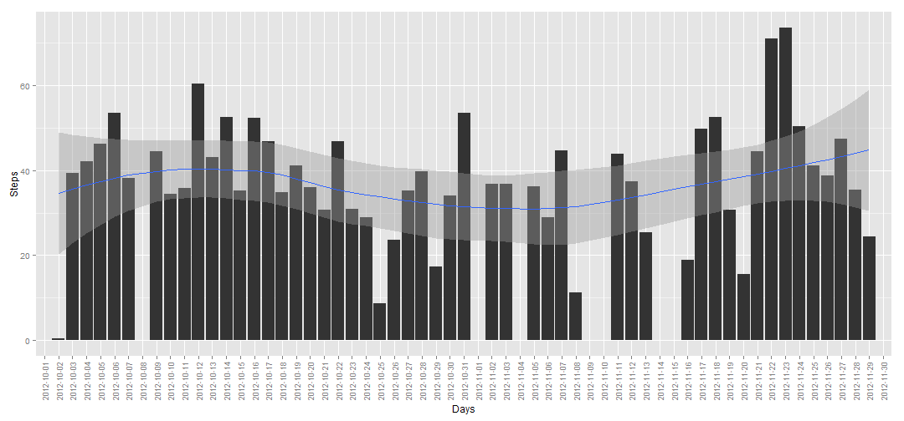

# Reproducible Research: Peer Assessment 1
This project is focused on the use of knitr and R markdown and publishing results on github.

## Loading and preprocessing the data

```r
setwd("C:/ds/C5A1/")
options(warn = -1)

library(RCurl)
```

```
## Loading required package: bitops
```

```r
qs_zip_url <- "https://d396qusza40orc.cloudfront.net/repdata%2Fdata%2Factivity.zip"
qs_zip_filename <- "repdata-data-activity.zip"
qs_dataset_filename <- "activity.csv"
# download.file(url=qs_zip_url, destfile=qs_zip_filename, quiet=F)

if (!file.exists(qs_zip_filename)) {
    message("downloading data")
    qs_zipfile <- getURL(qs_zip_url, ssl.verifypeer = 0L, followlocation = 1L)
    writeLines(qs_zipfile, qs_zip_filename)
}

qsds <- read.csv(unz(description = qs_zip_filename, file = qs_dataset_filename), 
    header = TRUE, sep = ",")
```


## What is mean total number of steps taken per day

```r
library(ggplot2)
# suppressWarnings(avg_steps <-
# aggregate(qsds[,1:2],by=list(qsds$date),mean)[,1:2])
avg_steps <- aggregate(qsds[, 1:2], by = list(qsds$date), mean)[, 1:2]
names(avg_steps) <- c("Days", "Steps")
ggplot(avg_steps, aes(Days, Steps)) + geom_bar(stat = "identity") + geom_smooth(aes(group = 1)) + 
    theme(axis.text.x = element_text(angle = 90, vjust = 0.5, size = 9))
```

```
## geom_smooth: method="auto" and size of largest group is <1000, so using loess. Use 'method = x' to change the smoothing method.
```

 

```r

summary(avg_steps)
```

```
##          Days        Steps      
##  2012-10-01: 1   Min.   : 0.14  
##  2012-10-02: 1   1st Qu.:30.70  
##  2012-10-03: 1   Median :37.38  
##  2012-10-04: 1   Mean   :37.38  
##  2012-10-05: 1   3rd Qu.:46.16  
##  2012-10-06: 1   Max.   :73.59  
##  (Other)   :55   NA's   :8
```


## What is the average daily activity pattern?


## Imputing missing values


## Are there differences in activity patterns between weekdays and weekends?
